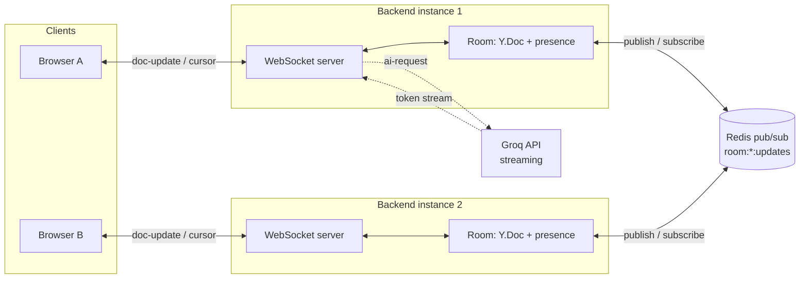

<h1 align="center">Pulse</h1>
<p align="center"><strong>A real-time collaborative text editor with AI suggestions that stream safely into concurrent edits.</strong></p>

<p align="center">
  
  
  
  
  
  
  
</p>

Open a room, share the link, and watch someone else's cursor move through the same document as yours. Type at the same time as they do and nothing gets clobbered. Hit **Continue writing** and an LLM completion streams in token by token — visible to everyone in the room, merging correctly even if someone else is typing at that exact moment.

Multiplayer text editing is a genuinely hard concurrency problem, and adding an LLM into the mix that's also mutating shared state in real time makes it harder. Pulse exists to work through that problem properly rather than glue together an off-the-shelf sync library: the CRDT document model is Yjs, but the WebSocket protocol, room/connection lifecycle, and cross-instance fan-out are hand-rolled.

## How it works

**Conflict-free editing.** Every document is a `Y.Text` CRDT. Clients don't send "replace the whole document" on every keystroke — the editor diffs the old and new value down to a minimal insert/delete, so two people typing in different parts of the same paragraph both land correctly instead of one overwriting the other. [`concurrentEditTest.ts`](packages/backend/scripts/concurrentEditTest.ts) proves this directly: two raw WebSocket clients race to insert distinct strings into the same document, and both converge on an identical, uncorrupted result.

**AI text is just another edit.** When you click *Continue writing*, the server streams a completion from Groq (`openai/gpt-oss-120b`, chosen because it's fast and free to run there — swap the model string in `streamSuggestion.ts` for any other streaming chat API; Groq's available model list shifts, so check `console.groq.com` if this one's gone) and inserts each token into the document the same way a keystroke would — through the same `Y.Text` operations, broadcast through the same `doc-update` path. There's no separate "AI text" rendering layer on the client. The tricky part is that the insertion point has to survive concurrent edits happening earlier in the document while tokens are still streaming in, so the anchor is a Yjs relative position (`createRelativePositionFromTypeIndex`) rather than a plain numeric offset — it gets re-resolved to a live index before every token is inserted. See [`streamSuggestion.ts`](packages/backend/src/ai/streamSuggestion.ts).

**Scaling past one process.** A single Node process can broadcast to its own connections from memory, no coordination needed. The moment you run a second instance, a client on instance A has no way to hear about an edit made by a client on instance B — so every room update also gets published to a Redis channel (`room:{roomId}:updates`), and every instance subscribed to that room relays it to its own local connections. See [`redisPubSub.ts`](packages/backend/src/redisPubSub.ts).

**Reconnecting without losing work.** Yjs is offline-first by design: a client keeps editing its local document while disconnected, and those edits merge automatically the moment it catches back up — no custom merge-on-reconnect logic needed. The WebSocket client reconnects with exponential backoff (500ms → 8s, capped at 10 attempts) and re-syncs the full document state on every reconnect. Getting this right in React 18 took an extra pass: creating the socket in `useMemo` looked fine until Strict Mode's dev-only mount → cleanup → remount cycle closed it before the first connection ever finished — the fix was moving the socket's entire lifecycle inside the effect that owns it, so each cleanup pass tears down cleanly instead of poisoning a shared instance.



## Try it

```bash
pnpm install
docker run -d -p 6379:6379 redis:7-alpine   # or: brew install redis && brew services start redis

# packages/backend/.env
echo "PORT=3001
REDIS_URL=redis://localhost:6379
GROQ_API_KEY=gsk_..." > packages/backend/.env

# packages/frontend/.env
echo "VITE_WS_URL=ws://localhost:3001" > packages/frontend/.env

pnpm dev:backend    # terminal 1
pnpm dev:frontend   # terminal 2
```

Open `localhost:5173`, click **New document**, then open the room URL again in a second window (or an incognito one) to see it as two people. `GROQ_API_KEY` is only needed for the AI suggestion button — everything else works without it, and Groq's free tier is enough to run it (get a key at [console.groq.com](https://console.groq.com/keys)).

## Testing

```bash
pnpm test:concurrent                              # the CRDT correctness test above
pnpm --filter backend test:load -- --n=100         # WebSocket broadcast latency, p50/p95/p99
```

On one local instance with a single room, broadcast latency holds at p50 ≈ 49ms / p95 ≈ 83ms / p99 ≈ 99ms with 100 concurrent connections sending cursor updates. Push to 200 in one room and it falls over — p50 jumps past a second — because per-room broadcast fan-out is O(n²) on a single event loop (each of *n* clients' updates gets serialized and sent to the other *n − 1*). Redis fixes cross-instance visibility, not this: 200 people actively moving their cursor in the *same* room will always bottleneck on whichever single instance is broadcasting to all of them. Sharding rooms across instances is what actually fixes it.

## Project layout

```
packages/
  backend/
    src/
      server.ts          Express + ws bootstrap, message routing
      rooms.ts            in-memory room registry (Y.Doc, connections, presence)
      redisPubSub.ts       cross-instance fan-out
      ai/streamSuggestion.ts   Groq streaming -> Yjs relative-position inserts
      protocol.ts          WebSocket message types
    scripts/
      concurrentEditTest.ts    the CRDT correctness proof
      loadTest.ts              connection/latency load test
  frontend/
    src/
      hooks/useYDoc.ts        Y.Doc + WebSocket wiring, offline-first reconnect
      hooks/usePresence.ts     remote cursor/user tracking
      components/Editor.tsx    textarea <-> Y.Text diff binding, caret preservation
      components/Cursor.tsx    remote caret rendering
```

## Design tradeoffs, briefly

Room state lives in server memory only — there's no database, and that's deliberate scope, not an oversight. A client's WebSocket dropping and reconnecting is fully safe (its local document survives and re-syncs). What *isn't* covered is a full backend process restart wiping every room that isn't actively being edited at that moment — a client with nothing new to send has no way to know the server forgot what it already had. Adding real persistence (a periodic Yjs snapshot to a database, replayed on room creation) would close that gap; it just wasn't in scope here.

No auth beyond an optional display name, no rich text, no document history beyond what Yjs gives for free — all intentional, all to keep the interesting part (concurrency, not CRUD) front and center.

---

MIT licensed. See [LICENSE](LICENSE).
